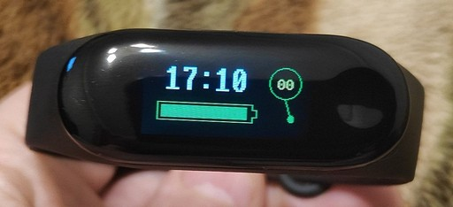

### t-wristband  
lilygo®ttgo t-wristband & micropython.   
This is an implementation of a micropython clock for the lilygo®ttgo t-wristband.  
The program is suitable for the version with the esp32 chip and the mpu9250 gyroscope.    
The version with a different gyroscope has completely different pins and you will have to modify the program yourself.  
Super short video: https://youtu.be/rZkwvvz0KFw  
I used a C video driver from this author: https://github.com/ccccmagicboy/st7735_mpy  
You need to compile the micropython along with this driver.  
Or you can take in this repository the already compiled firmware.bin  
I took the font files along with the display driver.  
The gyroscope files (mpu9250.py, mpu6500.py, ak8963.py) I took from here: https://github.com/tuupola/micropython-mpu9250  
In mpu6500.py changed the default address to 0x69.  
The pcf8563.py clock driver took from here: https://github.com/lewisxhe/PCF8563_PythonLibrary  
With the help of one button and combinations of long and short presses, you can set the time, date.  
Holding the button for 2-4 seconds turns on the calendar, and for more than 5 seconds transfers it to the menu.  

Updated.
I corrected pcf8563.py in the datasheet for the range of days of the week 0-6, and the author, for some reason, used 1-7.  
Added a compass. The compass must be calibrated for your area, otherwise it will show the weather on Mars. To calibrate, you need to select 'Calibrate' in the menu and smoothly, without jerks, rotate the bracelet along all possible axes for a minute. (As if you are winding a ball of wool and you need to wind it evenly over the entire area).
  
Let me remind you that you need to flash firmware.bin, and then copy 9 files to the device (vga2_bold_16x32.py, vga2_8x16.py, pcf8563.py, mpu9250.py, mpu6500.py, main.py, calib.py, boot.py, ak8963.py)
